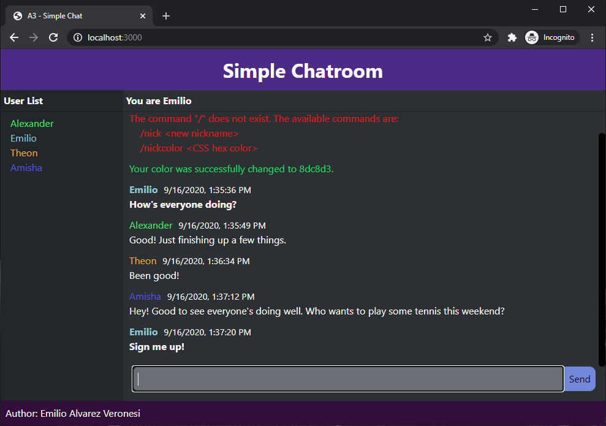

# Simple Chat App

The client and server code for a very simple chat room built with [socket.io](https://socket.io/).



## Setup

```
npm install
node index.js
```

The server should now be running, and accessible from a browser at `localhost:3000`.

## Functionality

- User Sessions: Cookies allow users to close and reopen the browser, while maintaining their preferences.
- Commands: Users can change their display name and color using /nick and /color.
- Chat History: Users will receive all messages sent since the server was started. Messages are stored in memory.

## Browsers

- Mozilla Firefox; Version 73.0.1 (64-bit)
- Google Chrome; Version 80.0.3987.132 (Official Build) (64-bit)

## Node Versions

- nodejs: v8.10.0
- npm: 3.5.2
